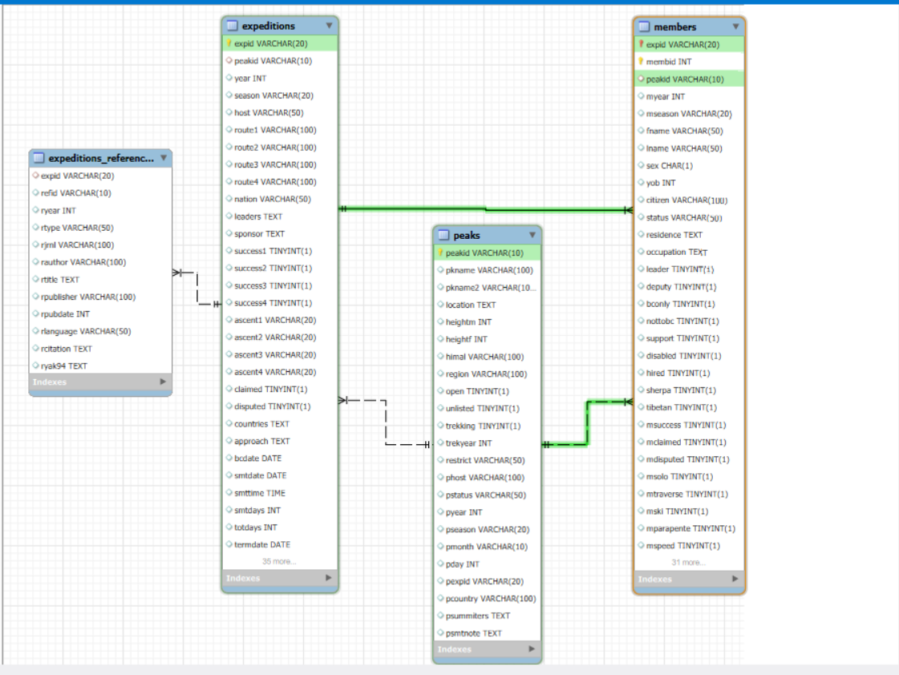
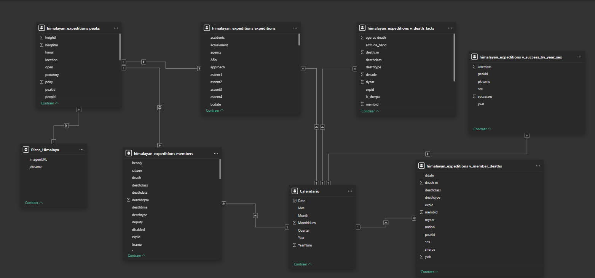
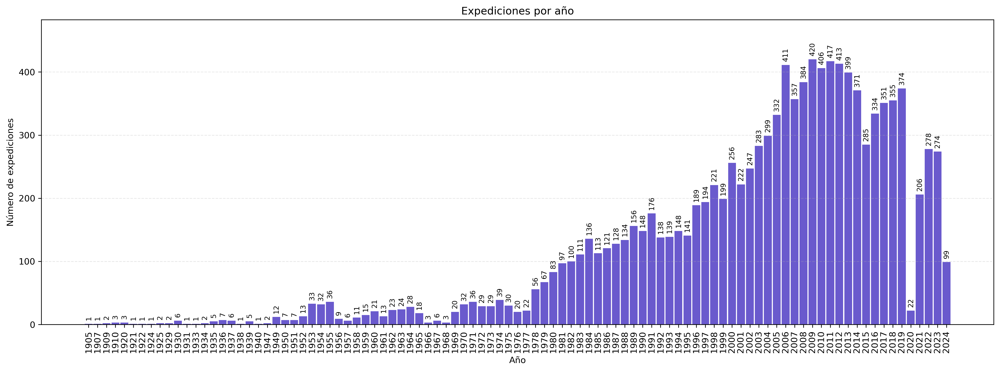
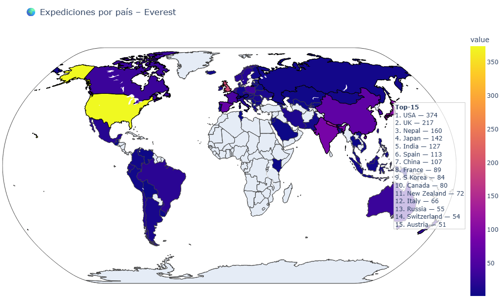
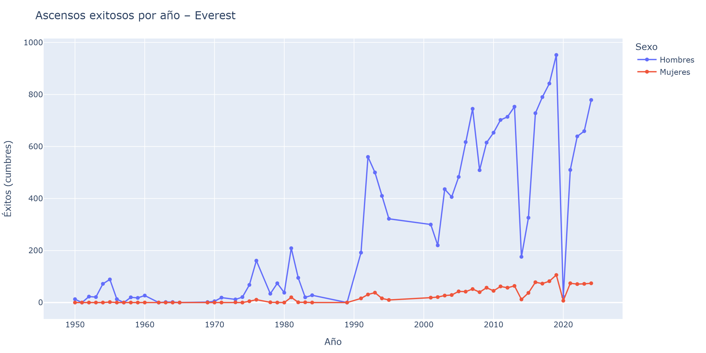
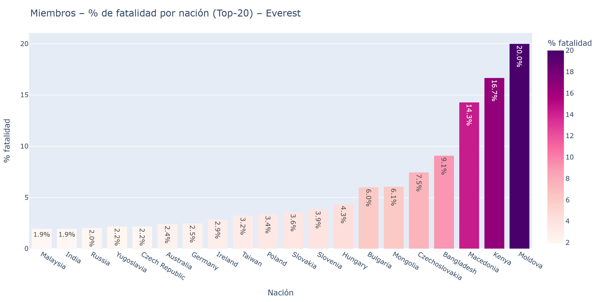
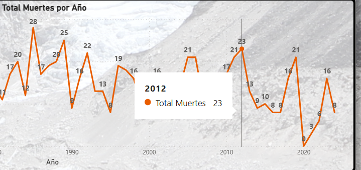
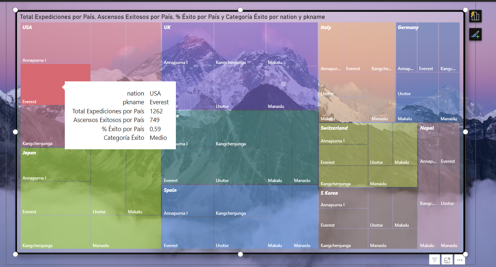

# Himalaya
Cordillera de los Himalayas: 🏔️ ***Análisis de Expediciones al Himalaya: Tendencias y Riesgos***


🎯 Objetivo principal
Analizar el registro histórico de ascensos en las montañas del Himalaya, explorando la relación entre altura, año, nacionalidad, éxito de la expedición y el riesgo asociado a partir de un conjunto de datos de expediciones.

---

**📂 Estructura del proyecto**

---
```
sql
📂 Proyecto_Himalaya/
├── 📊 BBDD/ 
│   ├── 📄 .gitkeep
│   ├── 📄 exped.csv
│   ├── 📄 himalayan_data_dictionary.csv
│   ├── 📄 members.csv
│   └── 📄 peaks.csv                     # Datasets de origen utilizados en el ETL
├── 📈 Dashboard/ 
│   ├── 📄 himalayan_project.pbix        # Archivo fuente del Dashboard de Power BI
│   ├── 📄 himalayan_project.pdf         # PDF exportado del Dashboard
│   └── 📄 power_bi[1-4].png             # Capturas de pantalla del Dashboard
├── 🧩 ERD/ 
│   ├── 📐 ERD_Himalayan_Expeditions.png # Diagrama Entidad-Relación (ERD)
│   └── 📄 himalayan_expeditions.mwb     # Archivo fuente de MySQL Workbench
├── 📓 Notebook/ 
│   ├── 📒 himalayan_project.ipynb       # Jupyter Notebook con el análisis principal
│   └── 📄 himalayan_project_notebook.pdf# PDF exportado del Notebook
├── 🗄️ SQL
│   ├── 📄 expeditions_fatality.sql
│   ├── 📄 expeditions_members.sql
│   ├── 📄 expeditions_por_anio.sql
│   ├── 📄 expeditions_por_pais.sql
│   ├── 📄 expeditions_por_pico_pais.sql
│   ├── 📄 expeditions_por_season.sql
│   ├── 📄 himalayan_expeditions.sql
│   ├── 📄 muertes_por_pico__mdeaths_ALL.sql
│   ├── 📄 top50_nations_por_expediciones.sql
├── 🛠️ Utils/ 
│   └── 📄 db_connection.py              # Script Python para la conexión a la base de datos
├── csv/                              # Archivos CSV intermedios o limpios (si aplica)
├── 📤 exportados/                       # Gráficos y figuras exportadas
└── README.md

```
---

## 📐 Diagrama ERD MySQL



---

## 📐 Diagrama ERD Power BI



---
## **🛠️ Tecnologías utilizadas**  


---

## **📚 Recursos**

- 📂 [Dataset original de Maven Analytics](https://mavenanalytics.io/data-playground/himalayan-expeditions) – Datos sobre expediciones al Himalaya de 1905 - 2024.  
- 💾 [Script SQL completo](SQL/himalayan_expeditions.sql) – Incluye la creación de tablas, normalización, inserciones de traducciones utilizadas en el análisis.
- 🗂️ [Consultas SQL](./sql/) – Scripts para replicar las consultas de análisis.  
- 📊 [Visualizaciones y figuras exportadas](./exportados/) – Gráficos y reportes generados en el proyecto.
- 🌐 [Ver Dashboard Power BI](https://app.powerbi.com/links/UJvvlN6tTB?ctid=58e889c2-cfaf-48cf-8649-705898b60c6c&pbi_source=linkShare)

---

 ## 📊 **Visualizaciones destacadas**

 🏔️ **Expediciones por año**  


---
 🏔️ **Expediciones Everest**  


---
 🏔️ **Ascensos exitosos en el Everest**  


---
 🏔️ **% Muertes expediciones al Everest**  


---

 📈 **Power BI**  


---
 📈 **Power BI**  


---
### **📖 Documentación de librerías y herramientas**
- 📘 [Pandas](https://pandas.pydata.org/docs/) – Análisis de datos en Python.  
- 📗 [Seaborn](https://seaborn.pydata.org/) – Visualización estadística.  
- 📙 [Plotly](https://plotly.com/python/) – Gráficos interactivos.  
- 🟦 [SQLAlchemy](https://docs.sqlalchemy.org/) – Conexión y manejo de bases de datos.  
- 🟩 [python-dotenv](https://saurabh-kumar.com/python-dotenv/) – Gestión de credenciales y variables de entorno.  
- 🟨 [Power BI](https://learn.microsoft.com/es-es/power-bi/) – Dashboards interactivos.

---

### **📌 Conclusión**

🏔️ ***Himalayan Expeditions Data Analysis***
---
Este proyecto aloja y analiza un conjunto de datos completo sobre expediciones y picos en el Himalaya, centrado principalmente en Nepal. El objetivo es proporcionar una base de datos limpia, organizada y geográficamente estructurada para la exploración estadística, la visualización de datos de escalada, y el análisis de la historia de las montañas más altas del mundo.
---

💾 Estructura de la Base de Datos (CSV)
---
**La información se distribuye a través de cinco archivos CSV clave ubicados en la carpeta BBDD/:**

**peaks.csv:** ⛰️ Catálogo principal de las montañas, incluyendo el estado de apertura (trekking o expedición), altitud, ubicación geográfica (cordillera, subcordillera) y el primer ascenso registrado.

**himalayan_data_dictionary.csv:** 📖 Diccionario de datos para todos los campos utilizados en los archivos CSV.

**exped.csv:** 📅 Registros detallados de cada expedición, incluyendo fechas, rutas y resultados.

**members.csv:** 🧑‍🤝‍🧑 Información sobre los miembros de las expediciones, como nacionalidad, rol (líder/miembro) y destino (cumbre/muerte).

**refer.csv:** 🔗 Información de referencia cruzada.

---
**⚙️ Nota Técnica (Git LFS)**
---
Debido al tamaño considerable de los archivos de expediciones (exped.csv, members.csv, refer.csv), este repositorio utiliza Git LFS (Large File Storage) para rastrear estos archivos, asegurando la eficiencia del repositorio principal sin problemas de tamaño.
